# SketchMotion 🎨✨

**Welcome to the era of Gemini 3.**

SketchMotion is an **iterative human-in-the-loop context building sketch suggestions tool** built for the **Gemini 3 Global Hackathon**. It transforms the solitary act of sketching into a collaborative dialogue with AI, where your rough ideas are understood, refined, and brought to life in real-time.

---

## 📚 Table of Contents
- [About the Project](#-about-the-project)
- [Gemini 3 Integration](#-gemini-3-integration)
- [System Architecture](#-system-architecture)
- [Data Flow & Logic](#-data-flow--logic)
    - [The Stroke Lifecycle](#1-the-stroke-lifecycle)
    - [Smart Grouping Engine](#2-smart-grouping-engine)
    - [AI Analysis Loop](#3-ai-analysis-loop)
    - [Context & Memory](#4-context--memory)
- [Installation & Setup](#-installation--setup)
- [Usage Guide](#-usage-guide)

---

## 🚀 About the Project

Traditional AI tools often feel like black boxes: you give an input, you get an output. SketchMotion changes this paradigm by introducing an **interactive feedback loop**.

Instead of guessing what you want from a single prompt, SketchMotion **watches you draw**, predicts your intent in real-time, and asks for verification. This "context building" approach ensures that the AI understands the *nuance* of your specific creation, leading to far more accurate and relevant results than simple one-shot generation.

---

## 💎 Gemini 3 Integration

SketchMotion is powered by the **Gemini 3 Model Family**, leveraging specific models for different stages of the user experience to optimize for both speed and intelligence.

| Feature | Model | Why? |
|Feature|Model|Why?|
|:---|:---|:---|
|**Real-time Visual Reasoning**|**Gemini 3 Flash** ⚡|We utilize Flash's multimodal capabilities to not just "see" pixels, but to *reason* about spatial relationships. It differentiates between a "circle" that is a wheel vs. a "circle" that is a sun based on the surrounding context.|
|**Deep Contextual Analysis**|**Gemini 3 Pro** 🧠|When ambiguity is high, Pro steps in. It handles the "Reasoning" phase of our pipeline, synthesizing user feedback history with visual data to construct a coherent scene graph.|
|**Hi-Fi Generation**|**Gemini Image Generation** 🎨|A specialized pipeline that transforms the crude sketch into professional assets. It uses the *verified context* to build a highly specific prompt, ensuring the output matches the user's intent perfectly.|

### The Gemini Pipeline
We treat the Gemini 3 API not just as a classifier, but as a **Collaborative Reasoning Engine**.

```mermaid
graph TD
    DualView[👁️ Dual-View Input] -->|Intent + Context| Reasoning[🧠 Reasoning Engine]
    Reasoning -.->|Gemini 3 Pro| PromptEng[🔄 Prompt Engineering]
    PromptEng -->|Dynamic Constraints| Suggestion[�️ Suggestion]
    
    Suggestion --> UserParams{Verified?}
    UserParams -- Yes --> Lock[✅ verified: Lock to Graph]
    UserParams -- No --> SelfCorrect[📝 Self-Correction]
    
    SelfCorrect -->|Inject 'NOT X'| PromptEng
```



**Contextual Prompt Construction**:
Every time Gemini analyzes a stroke, it doesn't just look at the image. It reads the **Session Context Graph**.
1.  **Ingest**: Gemini receives the *intent image* (bright strokes) vs *context image* (dim strokes).
2.  **Recall**: It pulls previous affirmations. *Example: "User already confirmed the 'green circle' is a 'tree'."*
3.  **Synthesize**: It constructs a dynamic prompt:
    > "Analyze the bright strokes. CONTEXT: The green circle nearby is a TREE. Therefore, is this bright stroke likely a falling apple or a bird? NOTE: User previously rejected 'cloud'."
4.  **Predict**: It returns a result that is logically consistent with the established scene.

---

## 🏗️ System Architecture

The application is built on a **Serverless/Edge Architecture** to ensure low latency for global users. The frontend handles real-time interactions and heuristic processing, while the edge backend manages AI orchestration and session state.

```mermaid
graph LR
    Client[🎨 Client UI] 
    Edge[⚡ Edge API]
    Gemini[🧠 Gemini 3 API]
    KV[(🗄️ Session KV)]

    Client -->|1. Stroke Data| Edge
    Edge -->|2. Analyze Prompt| Gemini
    Gemini -->|3. Result| Edge
    Edge -->|4. Suggestion| Client
    Edge -->|Context Memory| KV
    Client -->|5. Feedback| Edge
```



### Component Breakdown

1.  **Client (Svelte 5 & Canvas)**:
    *   Handles high-frequency input (60fps drawing).
    *   Runs the **Heuristic Grouping Engine** locally to minimize API calls.
    *   Manages the "Optimistic UI" for instant feedback.

2.  **Edge API (Cloudflare Workers)**:
    *   Acts as the orchestration layer.
    *   Implements **Rate Limiting** and **Session Management**.
    *   Constructs complex, multi-modal prompts for Gemini.

3.  **Session Memory (Cloudflare KV)**:
    *   Stores the "Mind Map" of the current drawing session.
    *   Persists user confirmations ("This is a cat", "This is NOT a dog") to guide future AI predictions.

---

## 🔄 Data Flow & Logic

### 1. The Stroke Lifecycle
Every line you draw goes through a rigorous normalization process before it ever sees an AI.

1.  **Raw Input**: Pointer events are captured.
2.  **Smoothing**: Catmull-Rom splines are applied to smooth wobbly lines.
3.  **Feature Extraction**: We calculate geometric properties for every stroke:
    *   *Temporal*: When was it drawn?
    *   *Spatial*: Center of mass, bounding box.
    *   *Kinematic*: Speed and acceleration.

### 2. Smart Grouping Engine
To prevent sending random noise to the AI, we implemented a custom **Heuristic Clustering Algorithm** that runs entirely in the browser. It groups strokes into "Candidates" based on likelihood of belonging to the same object.


*   **Temporal Coherence**: Strokes drawn in quick succession are likely related.
*   **Spatial Containment**: A small stroke inside a larger one (like an eye in a face) is automatically grouped.
*   **Kinematic Similarity**: Strokes drawn with similar speed and pressure are grouped.

#### 🤖 AI Semantic Correction (The Safety Net)
Heuristics aren't perfect. Sometimes, you draw a flock of birds, and the algorithm misses one. Or you draw a Giraffe, and the spots aren't grouped with the body.

When Gemini analyzes the scene, it performs a **Semantic Integrity Check**:
1.  **Color-Coded Context**: We pass the full scene to Gemini where every existing group has a unique color outline ID.
2.  **Visual Reasoning**: Gemini looks at the image and reasons: *"Hey, these 3 separate groups (circles) are actually spots inside this larger group (Giraffe body)."*
3.  **Merge/Split Suggestions**: The API returns explicit instructions to **MERGE** Group A, B, and C, or **SPLIT** Group D.
    *   *Example 1*: Merging a stray "bird" stroke back into the "Flock" group.
    *   *Example 2*: Merging "spots" + "body" + "neck" into a single "Giraffe" entity.

### 3. AI Analysis Loop
Once the grouping engine identifies a stable Candidate, the **AI Analysis Loop** begins. This is a two-pass visual analysis system.

1.  **Intent Image Generation**: The client generates a specific image containing *only* the candidate strokes (bright white on black).
2.  **Context Image Generation**: A second image is generated showing the *rest* of the sketch (dimmed gray), providing spatial context.
3.  **Prompt Construction**: The Edge API combines these images with the Session History.


### 4. Context & Memory
The "Secret Sauce" of SketchMotion is its memory. The system builds a graph of known truths about the sketch.

*   **Positive Reinforcement**: When you verify a prediction ("Yes, it's a tree"), that information is **locked**. The AI will assume that object is a tree in all future requests, helping it understand scale and perspective.
*   **Negative Constraints**: When you reject a prediction ("No, it's not a car"), that label is added to a **Negative Constraint List** for that specific group. Future prompts effectively say: *"Analyze this. We know for a fact it is NOT a car."*

### 🔮 Future Roadmap: Multimodal Video Analysis
We are currently exploring **Gemini 3's Video Input capabilities** to take this to the next level. Static images lose the *temporal* information of a sketch.
*   **Video as Context**: Instead of sending a static PNG, we plan to stream the **drawing process as a video** to Gemini.
*   **Dynamic Intent Recognition**: By analyzing the *speed* and *hesitation* of strokes, Gemini can infer intent.
    *   *Fast, jagged lines* → "Grass" or "Rough Texture"
    *   *Slow, careful curves* → "Cloud" or "Smooth Surface"
*   **Motion cues for Animation**: Understanding *how* a user draws a line (e.g., the direction of a wave) can automatically dictate how that object should be animated in the final output.

---

## 💿 Installation & Setup

### Prerequisites
*   Node.js (v20+)
*   pnpm

### Steps
1.  **Clone & Install**
    ```bash
    git clone https://github.com/yourusername/sketchmotion.git
    cd sketchmotion
    pnpm install
    ```

2.  **Environment Setup**
    Create a `.env` file with your Gemini 3 API key:
    ```env
    GOOGLE_API_KEY=your_key_here
    ```

3.  **Run Locally**
    ```bash
    pnpm dev
    ```

---

## 🎮 Usage Guide

### The Workflow
1.  **Draw**: Sketch naturally. The **Smart Grouping** will automatically collect your strokes.
2.  **Verify**: Look for the floating label. Click **Check** (✓) to confirm the AI's guess.
3.  **Correct**: Click **Cross** (✗) if it's wrong. The AI will immediately re-analyze with your feedback in mind.
4.  **Iterate**: As you confirm more objects, the AI's understanding of the scene improves ("Oh, that's a tree next to the house I already know about").
5.  **Finalize**: Use the **Generate** tool to turn your verified sketch into a polished asset.

---

*Built with ❤️ for the Gemini 3 Global Hackathon.*
